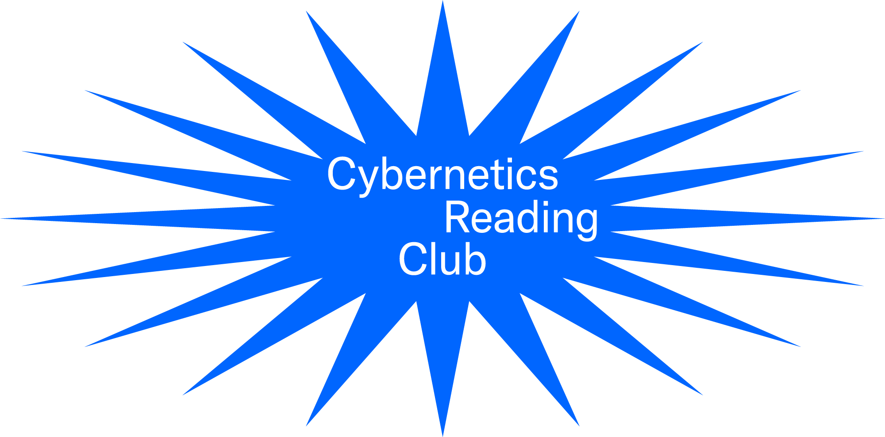

—--

A collection of learning resources, notes, etc.

—--

We have a few spots on the web:

- [Github](https://github.com/learning-gardens/cybernetics-club) (_you are here_): for sharing readings and static info
- [Google Group](https://groups.google.com/forum/#!forum/cybernetics-club): join to know when we're meeting and what we're reading
- [Slack](https://learning-gardens.slack.com): for discussion, hanging out, sharing links, etc -- you can [join here](https://lg-slack-automate.herokuapp.com/) (we're the `#cybernetics` chan)

---

Feel free to contribute!
